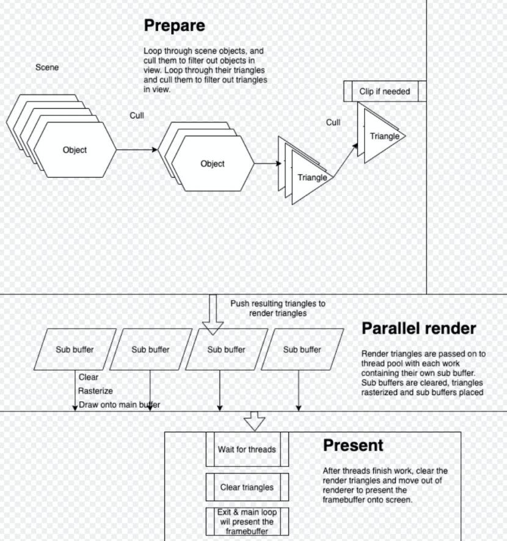

# Documentation of the app architecture

## `src/doom3d.c`: Entry point to the app

- Initialize app & threadpool
- Load first `src/scene`
  - Scene loads all assets related to the scene
  - Scene options are set in `src/scene/scene_data.c`
  - Scene ids are set in `include/doom3d.c`
  - If you wish to add test objects, see an example in e.g. `place_test_object` function in `src/scene/scene.c`
- After loading first scene, main loop is run like:

```c
	while (app->is_running)
	{
		window_frame_clear(app->window);
		if (app->is_loading)
		{
			loading_render(app);
			window_frame_draw(app->window);
			continue ;
		}
		events_handle(app);
		if (app->is_loading)
			continue ;
		doom3d_render(app);
		window_frame_draw(app->window);
	}
```

- `events_handle` function is an entry point for app's state organization. Events are read and based on that app state gets changed
- `doom3d_render` will then render the changed state (see Renderer flow chart)
- The framebuffer is then placed onto the window screen
- After exiting the app all data strucures are freed in `doom3d_cleanup`

## Scenes

- Hold all objects
- Menu options
- Triangle pointers for e.g. ray intersection calculation
- All in-game related data (except the player (could be in scene))

## Rendering



- Objects & triangles are culled based on camera viewbox
- Remaining triangles are copied, clipped onto `render_triangles` and their vertices are transformed for the rasterizer so that their origin is 0, 0, 0
- In parlallel:
  - Buffers are cleared
  - Triangles are rasterized
  - Buffers are drawn onto main buffer
- These `render_triangles` are then freed
- Main buffer will then be presented onto window

## Libs

Easiest way to learn how to use a function is to cmd+shift+f (app wide search) in your IDE and see where a function has been used.

- `lib3d`: 3d library holding all data structures and functionality that are general and not specific to doom3d.
  - 2D line drawing
  - Rasterization
  - Pixel plotting
  - Useful data structs
  - 3d .obj file reading
  - 3d object instantiation
  - bmp image reading
  - image placement from surface to surface (e.g. bmp onto framebuffer)
- `libgmatrix`: Vector and matrix math
- `libft`: c stdlib style functions and useful added functions on top of those
  - Hash(map/table), see `scene/assets/c` for usage, or `libft/tests`
  - Threadpool (see usage in `src/render/render.c`: `render_work_parallel` & `src/doom3d.c`: `doom3d_run`)
  - File reading (See `l3d_read_obj` for usage)
